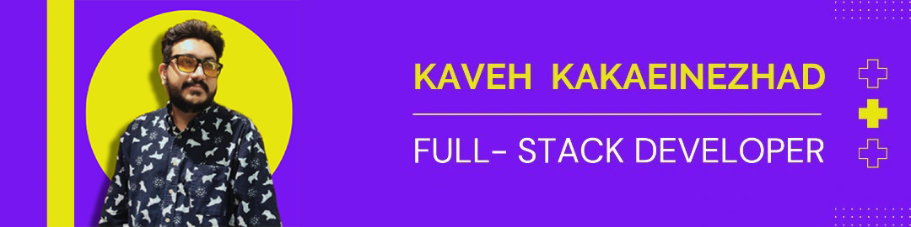

# 🚀 Kaveh Kakaei Nezhad  
**Full-Stack Developer | Software Engineer | Artist** 👨‍💻🎨🔐  

---

### 👋 About Me  
Hi there! I'm **Kaveh Kakaei Nezhad**, a passionate full-stack developer, software engineer and digital artist.  
I design and build modern web apps, scalable infrastructures, and creative digital experiences.  
With years of hands-on experience, I enjoy working across the full stack—from polished UI/UX to robust backend systems—and contributing to the **developer community** with open-source tools & research.  

🌍 Based in Iran | 🔭 Always learning | 🎶 Mixing tech, art & philosophy  

---

## 🌐 Connect with Me  

  
  
  
  
  
  
  

---

## 🧰 Tech Stack & Skills  

### 💻 Languages  
  
  
  
  
  
  
  
  
  
  
  

### ⚛️ Frontend  
React | Next.js | Redux | Tailwind | Bootstrap | Vite | Cypress | Jest  

### 🛠️ Backend & APIs  
Node.js | Express | Django | FastAPI | Flask | .NET | GraphQL | REST | OpenAPI  

### 🗄️ Databases  
PostgreSQL | MySQL | MongoDB | Redis | Elasticsearch | SQLite  

### ☁️ Cloud & DevOps  
AWS | GCP | Azure | Docker | Kubernetes | GitHub Actions | Jenkins | Linux  

---

## 📚 Projects & Repositories  

🔍 **Tools & Utilities**  
| Tool | Description | Link |  
|------|-------------|------|  
| **SubScan** | Subdomain scanner | [GitHub](https://github.com/behnamvanda/subscan) |  
| **RCEScan** | Remote Code Execution Scanner | [GitHub](https://github.com/behnamvanda/rce-scan) |  

📖 **Books**  
| Name | Publisher | Year |  
|------|-----------|------|  
| اعلی (*Aela*) | Daneshyaran | 2018 |  
| کوتاه به بلندای آسمان (*As High as the Sky*) | Daneshyaran | 2017 |  

---

## 📊 GitHub Stats  

  

  

  

